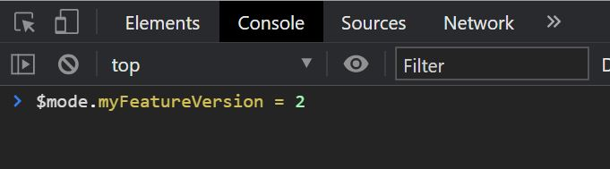
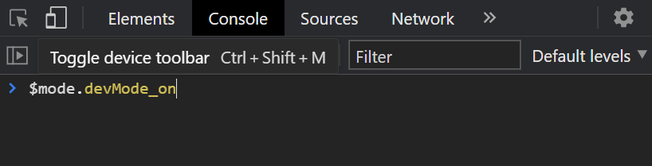
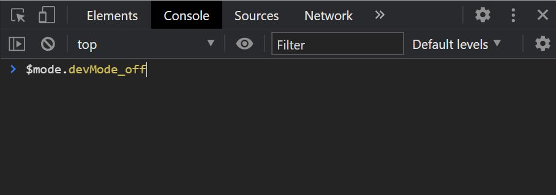
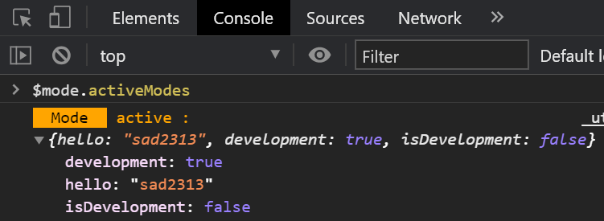
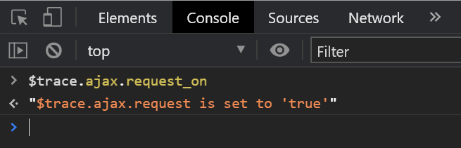

## Info

[](https://www.npmjs.org/package/mode-management)
[](https://bundlephobia.com/result?p=mode-management)
[](http://npm-stat.com/charts.html?package=mode-management)
[](http://npm-stat.com/charts.html?package=mode-management)

## Install

To install, use below code

```
npm install mode-management
```

Or

```
yarn add mode-management
```

# Mode Management Usage

You can add modes as shown in the following example:

```ts
import {ModeManagement} from 'mode-management';

const MY_FEATURE_VERSION = 'myFeatureVersion';
const defaultVersionForMyFeatures = 1
ModeManagement.add(MY_FEATURE_VERSION, defaultVersionForMyFeatures);


//And when you want to check modes you can use:

const modeVersion = ModeManagement.get(MY_FEATURE_VERSION)
switch (modeVersion) {
    case 1:
        showVersionOne();
        break;
    case 2:
        showVersionTwo();
        break;
    case 3:
        showVersionThree();
        break;
}

```

Now in `development tools > console tab` you can write below code to change modes manually:

For example this is screenshot of `Chrome dev tools > console tab`.

You can also use hooks for React:

```tsx
import {useMode, useModeMutation} from "mode-managment";

function DemoApplication() {
    const featureVersion = useMode(MY_FEATURE_VERSION);
    const setFeatureVersion = useModeMutation(MY_FEATURE_VERSION);

    switch (featureVersion) {
        case 1:
            return <span onClick={() => setFeatureVersion(2)}>
                version 1
            </span>;
            break;
        case 2:
            return <div onClick={() => setFeatureVersion(3)}>
                version 2
            </div>;
            break;
        case 3:
            return <p onClick={() => setFeatureVersion(1)}>
                version 3
            </p>;
            break;
    }
}

```

In this case, if you change mode in `console tab` on changing it anywhere, the component will be re-rendered.

For changing modes you can also use `ModeManagement.set`:

```ts
ModeManagement.set(MY_FEATURE_VERSION, 2);
```

Some times your mode is boolean (flags). For example, you want to check whether it is `test-version` to show some
elements to for Tester or Developers or not:

```ts
import {useModeFlag, useModeFlagMutation, ModeManagement} from "mode-managment";

const DEV_MODE = "devMode";
const defaultStateForDevMode = false; // It means dev mode is off by default;
ModeManagement.addFlag(DEV_MODE, defaultStateForDevMode);
ModeManagement.setFlag(DEV_MODE, true);

if (ModeManagement.getFlag(DEV_MODE)) {
    showDevToolsForTestAndDevelop();
}

// for react you can use below hooks :
const isDevMode = useModeFlag(DEV_MODE);
const setIsDevMode = useModeFlagMutation(DEV_MODE);
```

For activating boolean modes (flags). you can set them on or off in `console tab` in `Chrome dev tools`. To
set `devMode` on:

To set `devMode` off:

You don't need to call a function just read `$mode.devMode_on` to set the mode on and `$mode.devMode_off` to set it off.
(You just press enter for a normal `JavaScript property call`.)

To see all active Modes you can use the code below and press enter:


## Multiple Mode Managements

You may need to have more than on your application. Then you should create an object of `ModeManagementClass`:

```ts
import {ModeManagementClass} from "mode-managment";

const secondModeManagement = new ModeManagementClass();
secondModeManagement.addFlag(DEV_MODE, defaultStateForDevMode);

// and you should pass `secondModeManagement` to second argument of hooks :
const isDevMode = useModeFlag(DEV_MODE, secondModeManagement);
const setIsDevMode = useModeFlagMutation(DEV_MODE, secondModeManagement);
const mode = useMode(DEV_MODE, secondModeManagement);
const setMode = useModeMutation(DEV_MODE, secondModeManagement);
``` 

# Trace Logger Usage

Trace logger is a tool for logging, trace, develop and test. It is similar to ModeManagement but just for logging and is
not accepting value, just boolean. ModeManagement its self, is using TraceLogger to log `active modes`.

For example below code will never log anything, unless you activate your logger in `console tab` of `Chrome dev tools`:

```ts

const tracer = new TraceLogger('ajax', ['response', 'request', 'unauthorized']);

// set below codes in interceptors ↓
if (tracer.get('request'))
    console.log(request);
if (tracer.get('response'))
    console.log(response);
if (tracer.get('unauthorized') && response.status === 401)
    console.log('We have an unauthorized request!', request)
```

For example if we want to see logs for every `request`, we should write below code in `console tab`:


# Real Examples

You can also clone code and run `npm start` to see below examples in `src/_dev` folder.
